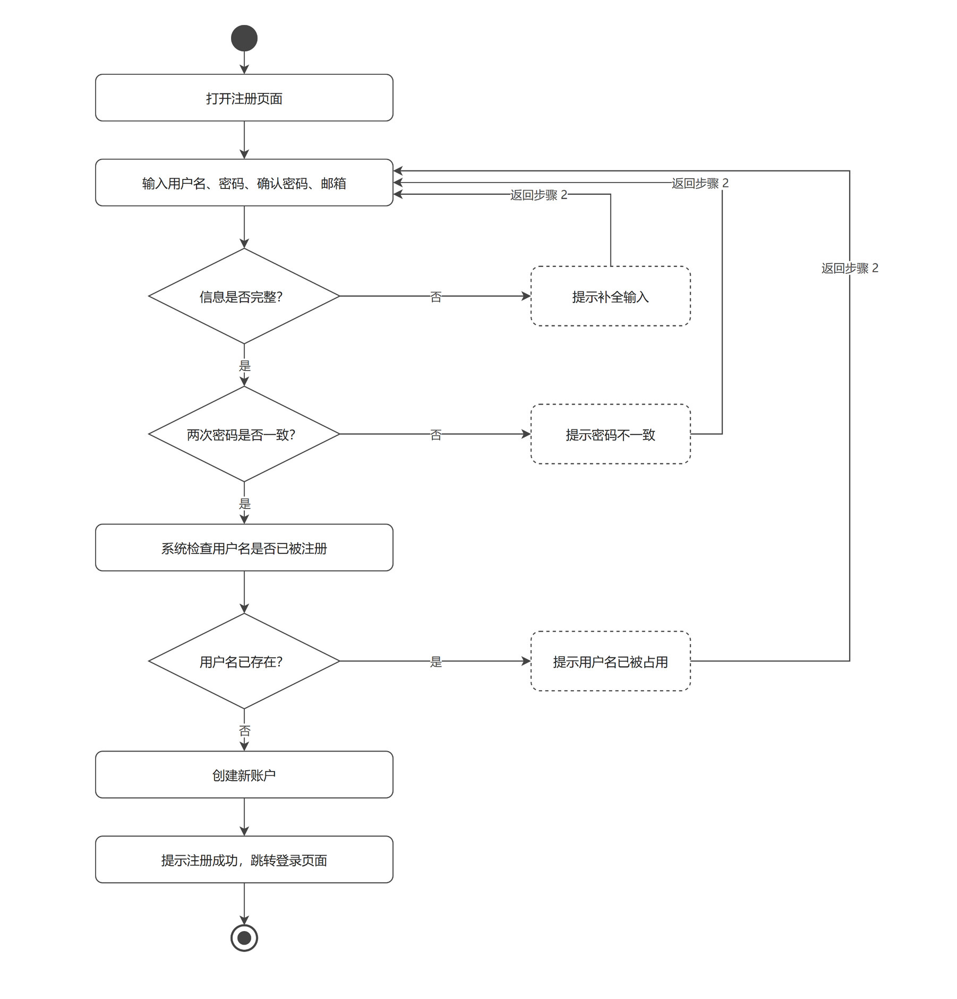
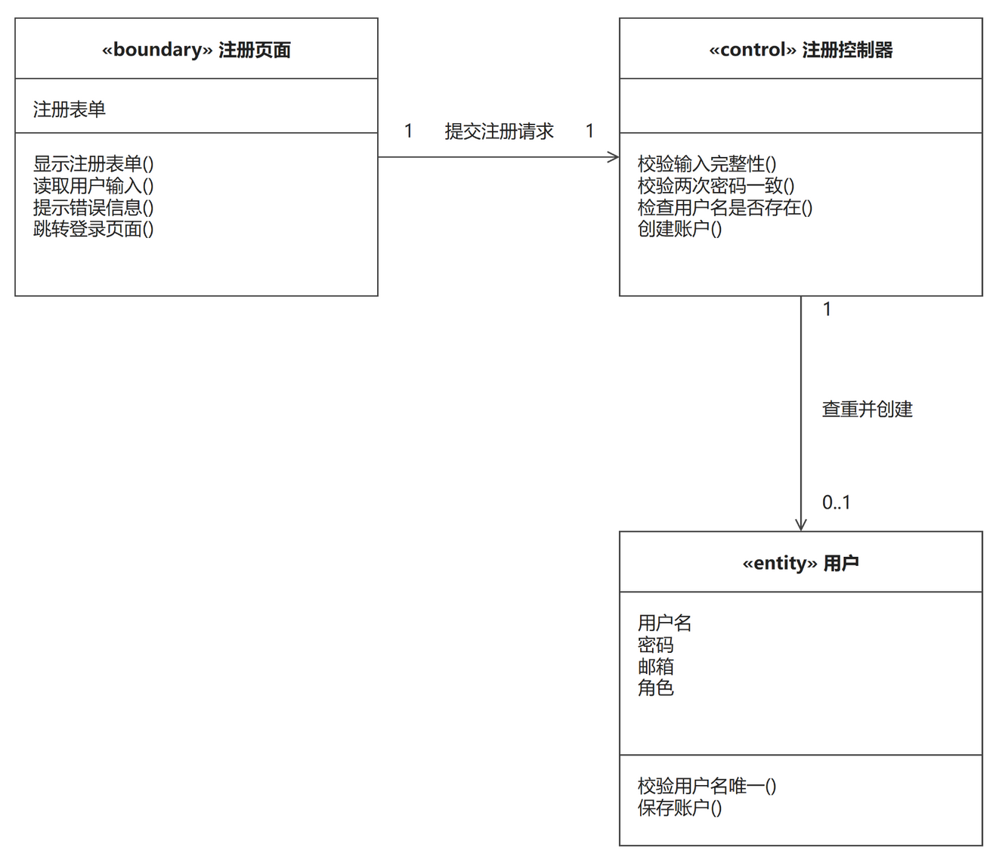
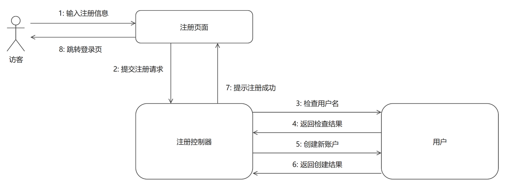

# 用户注册

> 本模块（账户管理）的另一个用例「用户登录」见 `用户登录.md`，两个用例共用同一张模块用例图。
> 「用户注册」的三张图由本目录 `gen_figures.py` 生成（.drawio），再用本机 draw.io 命令行导出 PNG，改图请改脚本后重新导出；
> 「用户登录」三张图与模块用例图按组长 835c105 修订后的新版样例，从 main 的 `docs/交付/1-账户管理-成员B/` 整体拷贝，与本脚本无关。

## 一、功能描述

### 1. 用例描述

- **用例名称**：用户注册
- **参与者**：访客（未注册用户）
- **前置条件**：无
- **基本流程**：
  1. 用户打开注册页面；
  2. 输入用户名、密码、确认密码、邮箱；
  3. 系统检查用户名是否已被注册；
  4. 用户名可用，系统创建新账户；
  5. 提示注册成功，自动跳转登录页面。
- **扩展流程**：
  - 2a. 两次输入密码不一致，系统提示错误，返回步骤 2；
  - 2b. 输入信息不完整（必填项为空），系统提示补全，返回步骤 2；
  - 3a. 用户名已存在，系统提示"该用户名已被占用"，返回步骤 2。
- **后置条件**：系统中新增一个普通用户账户。

（与 `docs/需求分析/02_用例描述初稿.md` 用例 1 口径一致，未做改动。）

### 2. 用例图

**图说明**：大矩形为系统边界（电子相册系统），内部两个椭圆是本模块的两个用例"用户注册"和"用户登录"。参与者"普通用户"连接两个用例；参与者"管理员"只连接"用户登录"，表示管理员账户由系统预置、不开放注册，登录行为与普通用户复用同一用例。参与者与用例之间为无箭头实线，表示"参与"关系。本用例对应的参与者是尚未注册的用户，其与"用户注册"的连接即表示一次注册行为由该类用户发起。

（口径说明：用例描述中该参与者按初稿写作"访客（未注册用户）"；用例图中统一画为"普通用户"，与《作业说明》图 1 的表示一致——注册成功后该用户即成为普通用户，二者是同一参与者的前后状态，不另设一个参与者。）

### 3. 活动图

**图说明**：主流程自上而下：打开注册页面 → 输入用户名、密码、确认密码、邮箱 → 校验输入 → 系统检查用户名是否已被注册 → 创建新账户 → 提示注册成功并跳转登录页面 → 结束。三个扩展流程各画成一个菱形分支，与用例描述一一对应：判断"信息是否完整？"为否时进入虚线框"提示补全输入"（扩展流程 2b）；判断"两次密码是否一致？"为否时提示"密码不一致"（扩展流程 2a）；系统检查用户名后判断"用户名已存在？"为是时提示"用户名已被占用"（扩展流程 3a）。三条错误分支处理后都拐回步骤 2"输入用户名、密码、确认密码、邮箱"，形成回路，对应用例描述中三处"返回步骤 2"；三条回程线各走一条独立的竖直通道，互不穿越，也避开所有矩形框。判断"用户名已存在？"为否（用户名可用）才进入"创建新账户"，即基本流程第 4 步。

## 二、逻辑分析与建模

### 1. 类模型图

**图说明**：从用例描述中提取名词作为候选类、动词作为候选方法，按边界/控制/实体（BCE）分为三个分析类。类框为三栏式矩形拼接：第一栏类名（带 «boundary»/«control»/«entity» 版型），第二栏属性，第三栏方法，栏间为实线分隔；"注册控制器"无属性，属性栏留空。边界类"注册页面"负责与用户交互：显示注册表单、读取用户输入、提示错误信息、跳转登录页面；控制类"注册控制器"负责协调：校验输入完整性、校验两次密码一致、检查用户名是否存在、创建账户，分别对应三个扩展流程的判定与基本流程第 3、4 步；实体类"用户"保存账户数据（用户名、密码、邮箱、角色），并提供"校验用户名唯一"和"保存账户"方法。关联关系："注册页面"与"注册控制器"为 1:1（每次注册由页面提交一次请求给控制器）；"注册控制器"与"用户"为 1 : 0..1——控制器按用户名查重，只有查不到（用户名可用）时才创建新用户，因此用户端多重性为 0..1，这一点正对应扩展流程 3a。同一条关联线上的关联名与两端多重性统一放在线的同一侧（水平线一律在上方、垂直线一律在右方），前后位置一致，读图不错位。

### 2. 协作图

**图说明**：协作图展示用例执行过程中各对象的消息往来。参与者按用例描述标注为"访客"（本用例的参与者即访客/未注册用户），保存账户数据的实体对象为"用户"，两者不同名，消息的发起者与接收者一目了然；对象框内不写冒号。每条消息是一根两端坐标写死的独立直线段，编号标签紧贴自己那根线（水平线标签在线上方，垂直线标签在线的左/右侧），两对象之间的双向消息画成两条平行线、各自带箭头标明方向，消息与箭头一一对应，不会混淆。消息编号与用例基本流程一一对应：1 访客输入注册信息（用户名、密码、确认密码、邮箱，基本流程第 2 步）→ 2 页面把注册请求提交给控制器 → 3 控制器请求"用户"对象检查用户名是否已存在（第 3 步）→ 4 返回检查结果 → 5 用户名可用，控制器请求创建并保存新账户（第 4 步）→ 6 返回创建结果 → 7 控制器通知页面提示注册成功并跳转登录页（第 5 步）→ 8 页面向访客显示登录页面。扩展流程的体现：当消息 4 返回"用户名已存在"时，控制器改为让页面提示错误并停留在注册页，消息 5～8 不发生；校验输入不完整或两次密码不一致（扩展流程 2a、2b）在控制器内部判定，不产生对"用户"对象的访问，同样不进入消息 5～8。

---

## 提交前自查（本用例）

- [x] 用例描述六段式齐全，与 `docs/需求分析/02_用例描述初稿.md` 用例 1 口径一致（仅"访客/普通用户"的图例表示已加说明）
- [x] 活动图 1 张，三个扩展流程 2a、2b、3a 全部画成分支，错误分支均拐回步骤 2 形成回路
- [x] 用例图与"用户登录"共用同一张（账户管理模块用例图），且与 main 上的新版样例字节一致
- [x] 类模型图为三栏式矩形拼接（类名/属性/方法，无灰色分隔线），关联带箭头与多重性，同一关联线上的文字统一在线的同侧
- [x] 协作图对象框内不带冒号；消息按执行顺序编号（1～8）且与基本流程对应；双向消息画成两条平行带箭头线，编号标签紧贴所属线段
- [x] 每幅图后均有文字说明
- [x] PNG 已逐张目检：无穿框、无压字、无错位、文字完整；`.drawio` 与 `.png` 同步重新生成并一并提交
- [x] 图片引用为相对路径，GitHub 上可正常显示
