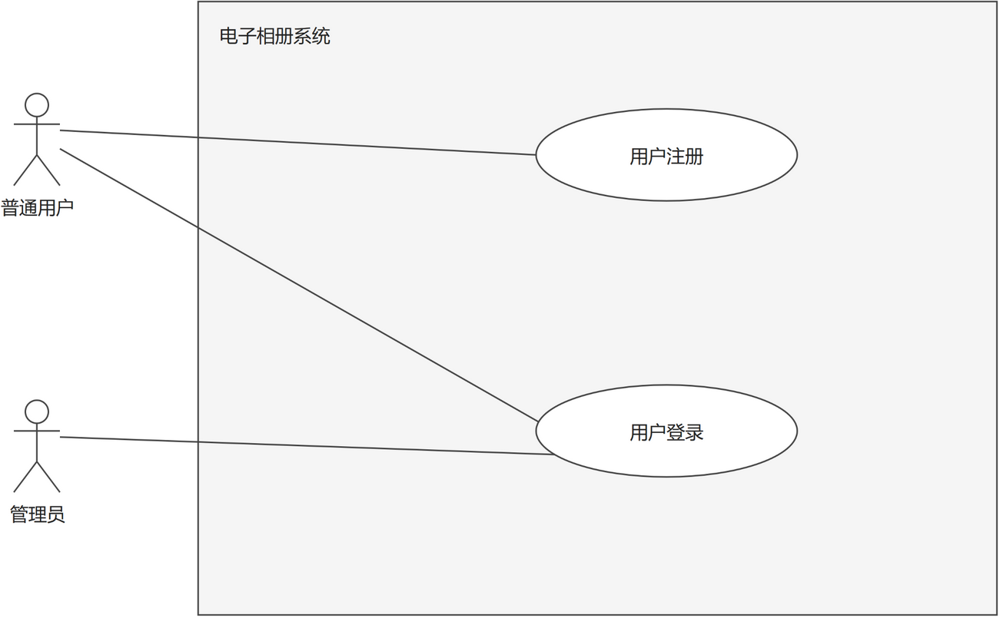
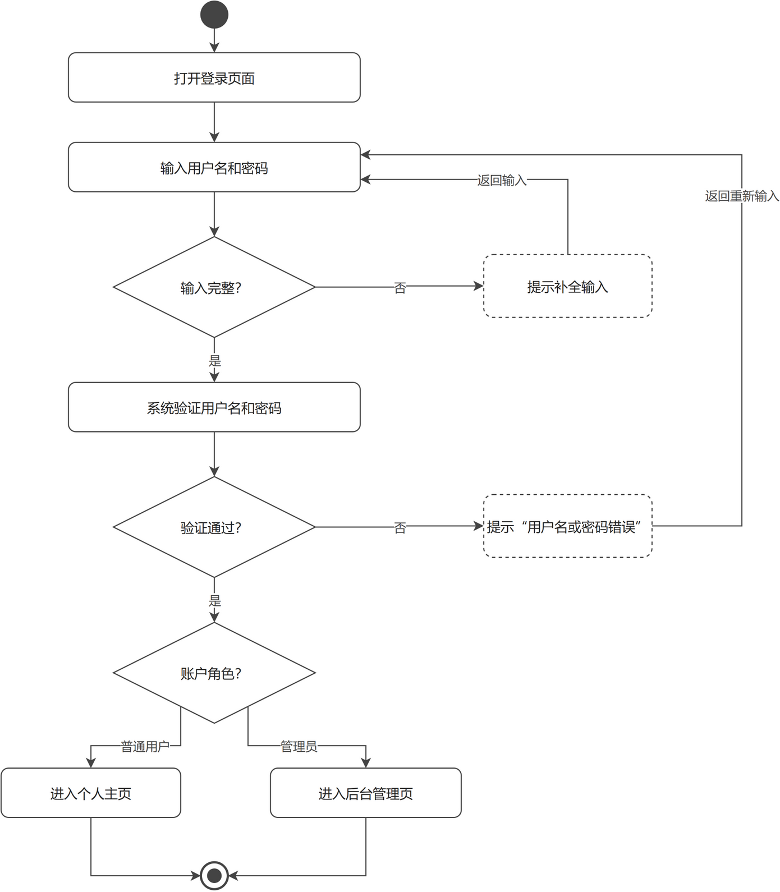
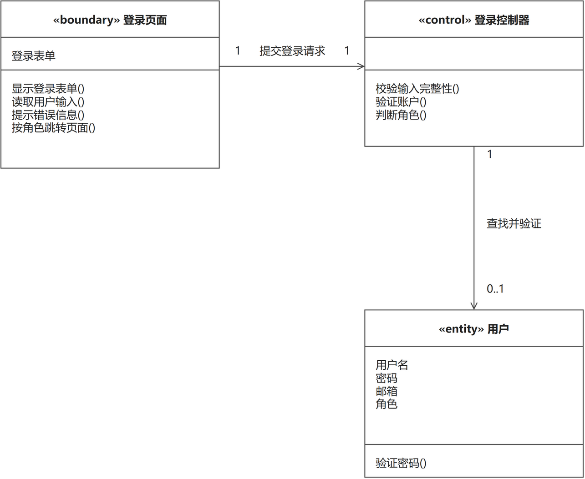
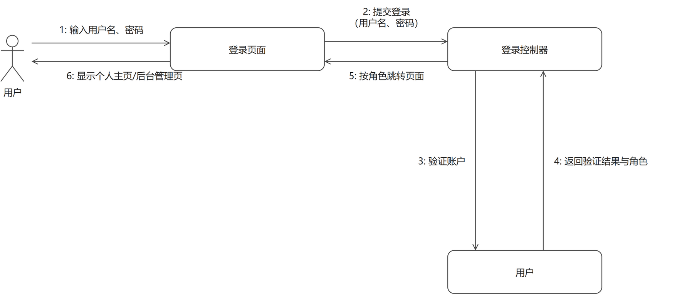

# 用户登录（成员 B · 账户管理模块）

> 本文件是单个功能用例的完整交付示例：功能描述（用例 + 用例图 + 活动图）+ 逻辑分析与建模（类模型图 + 协作图）。
> 同模块的「用户注册」用例见 `用户注册.md`，两个用例共用同一张模块用例图。

## 一、功能描述

### 1. 用例描述

- **用例名称**：用户登录
- **参与者**：普通用户、管理员（管理员是特殊用户，复用本用例，不单独设"管理员登录"用例）
- **前置条件**：用户已注册（账户已存在）
- **基本流程**：
  1. 用户打开登录页面；
  2. 输入用户名和密码；
  3. 系统验证用户名和密码；
  4. 验证通过，系统根据账户角色跳转：普通用户进入个人主页，管理员进入后台管理页。
- **扩展流程**：
  - 2a. 用户名或密码为空，系统提示补全，返回步骤 2；
  - 3a. 用户名不存在或密码错误，系统提示"用户名或密码错误"，返回步骤 2。
- **后置条件**：用户处于登录状态，系统记录当前登录用户及其角色。

（与 `docs/需求分析/02_用例描述初稿.md` 用例 2 口径一致，未做改动。）

### 2. 用例图

**图说明**：大矩形为系统边界（电子相册系统），内部两个椭圆是账户管理模块的两个用例。参与者"普通用户"连接注册和登录两个用例；参与者"管理员"只连接"用户登录"，表示管理员不开放注册（账户由系统预置），登录行为与普通用户复用同一用例。参与者与用例之间为无箭头实线，表示"参与"关系。

### 3. 活动图

**图说明**：主流程自上而下：打开登录页面 → 输入用户名和密码 → 校验输入 → 验证账户 → 按角色跳转 → 结束。两个扩展流程画成判断分支："输入完整？"为否时进入虚线框"提示补全输入"，随后回路拐回"输入用户名和密码"；"验证通过？"为否时提示"用户名或密码错误"，同样返回重新输入。验证通过后由"账户角色？"判断分流：普通用户进入个人主页，管理员进入后台管理页，两条路径汇合后结束。用三个菱形分别对应用例描述中的扩展流程 2a、3a 和基本流程第 4 步的角色分流。

## 二、逻辑分析与建模

### 1. 类模型图

**图说明**：从用例描述中提取名词作为候选类、动词作为候选方法，按边界/控制/实体（BCE）分为三个分析类。类框为三栏式矩形拼接：第一栏类名（带 «boundary»/«control»/«entity» 版型），第二栏属性，第三栏方法，栏间为实线分隔；"登录控制器"无属性，属性栏留空。边界类"登录页面"负责与用户交互：显示表单、读取输入、提示错误、按角色跳转；控制类"登录控制器"负责协调：校验输入完整性、验证账户、判断角色；实体类"用户"保存账户数据（用户名、密码、邮箱、角色），并提供"验证密码"方法。关联关系："登录页面"与"登录控制器"为 1:1（每次登录由页面提交一次请求给控制器）；"登录控制器"与"用户"为 1 : 0..1——控制器按用户名查找账户，可能查不到（对应验证失败的扩展流程 3a），因此用户端多重性为 0..1。同一条关联线上的关联名与两端多重性统一放在线的同一侧（水平线一律在上方、垂直线一律在右方），前后位置一致，读图不错位。

### 2. 协作图

**图说明**：协作图展示用例执行过程中各对象的消息往来：参与者"用户"与三个对象（登录页面、登录控制器、用户实体）之间共 6 条消息，编号与用例基本流程一一对应：1 输入用户名、密码（基本流程第 2 步）→ 2 页面把登录请求提交给控制器 → 3 控制器请求"用户"对象验证账户、4 返回验证结果与角色（第 3 步）→ 5 控制器通知页面按角色跳转（第 4 步）→ 6 页面向用户显示个人主页或后台管理页。每对对象之间的双向消息画成两条平行线，各自带箭头标明方向；编号标签紧贴所属线段（水平线标签在线上方、垂直线标签在线侧方），消息与箭头一一对应，不会混淆。扩展流程的体现：当消息 4 返回"验证失败"时，控制器改为让页面提示错误并停留在登录页，消息 5、6 不发生。

---

## 提交前自查（本用例）

- [x] 用例描述六段式齐全，与 02 初稿口径一致
- [x] 活动图覆盖扩展流程 2a、3a，错误分支均形成回路
- [x] 类模型图为三栏式矩形拼接（类名/属性/方法，无灰色分隔线），关联带箭头与多重性，同一关联线上的文字统一在线的同侧
- [x] 协作图对象框内不带冒号；消息按执行顺序编号（1–6）且与基本流程对应；双向消息画成两条平行带箭头线，编号标签紧贴所属线段
- [x] 每幅图后均有文字说明
- [x] PNG 已目检：无穿框、无压字、文字完整；`.drawio` 源文件已一并提交
