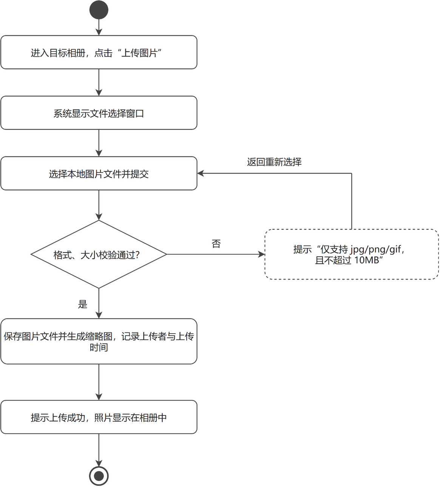
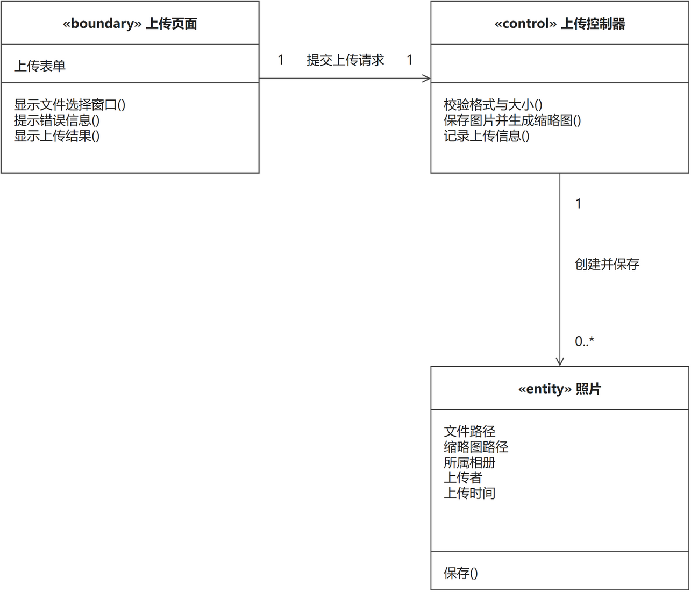
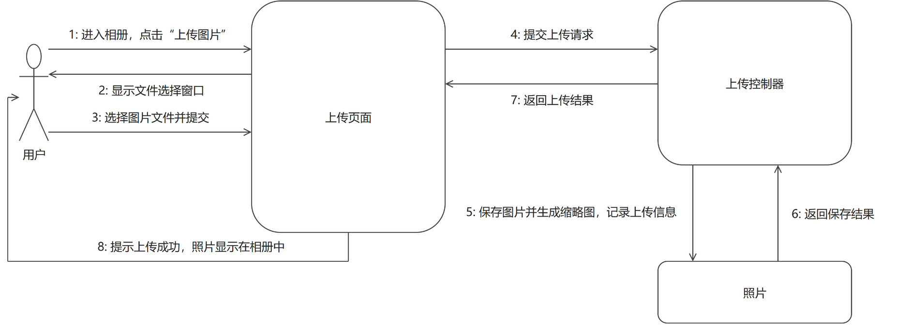

# 上传图片（成员 D · 照片管理模块）

> 本文件是单个功能用例的完整交付：功能描述（用例 + 用例图 + 活动图）+ 逻辑分析与建模（类模型图 + 协作图）。
> 同模块的「浏览照片」用例见 `浏览照片.md`，两个用例共用同一张模块用例图。

## 一、功能描述

### 1. 用例描述

- **用例名称**：上传图片
- **参与者**：普通用户
- **前置条件**：用户已登录，目标相册已存在
- **基本流程**：
  1. 用户进入目标相册，点击"上传图片"；
  2. 系统显示文件选择窗口；
  3. 用户选择本地图片文件并提交；
  4. 系统校验文件格式（jpg/png/gif）和大小（不超过 10MB）；
  5. 校验通过，系统保存图片文件并生成缩略图，记录上传者和上传时间；
  6. 提示上传成功，照片显示在相册中。
- **扩展流程**：
  - 4a. 格式或大小不符合要求，系统提示"仅支持 jpg/png/gif，且不超过 10MB"，返回步骤 3。
- **后置条件**：相册中新增一张照片（记录上传者、所属相册、上传时间）。

（与 `docs/需求分析/02_用例描述初稿.md` 用例 6 口径一致，未做改动。）

### 2. 用例图

**图说明**：大矩形为系统边界（电子相册系统），内部两个椭圆是照片管理模块的两个用例。参与者"普通用户"连接"上传图片"和"浏览照片"两个用例，表示照片的上传与浏览都由普通用户发起；系统不提供管理员代传图片的功能，因此没有其他参与者。参与者与用例之间为无箭头实线，表示"参与"关系。

### 3. 活动图

**图说明**：主流程自上而下：进入目标相册点击"上传图片" → 系统显示文件选择窗口 → 选择本地图片文件并提交 → 校验格式与大小 → 保存图片文件并生成缩略图、记录上传者与上传时间 → 提示上传成功 → 结束。扩展流程 4a 画成判断分支：菱形"格式、大小校验通过？"为否时进入虚线框提示"仅支持 jpg/png/gif，且不超过 10MB"，随后回路拐回"选择本地图片文件并提交"，让用户重新选择文件；为是时继续主流程。菱形判断与用例描述中的扩展流程 4a 一一对应。

## 二、逻辑分析与建模

### 1. 类模型图

**图说明**：从用例描述中提取名词作为候选类、动词作为候选方法，按边界/控制/实体（BCE）分为三个分析类。边界类"上传页面"负责与用户交互：显示文件选择窗口、提示错误信息、显示上传结果；控制类"上传控制器"负责协调：校验格式与大小、保存图片并生成缩略图、记录上传信息；实体类"照片"保存照片数据（文件路径、缩略图路径、所属相册、上传者、上传时间），并提供"保存"方法。关联关系："上传页面"与"上传控制器"为 1:1（每次上传由页面提交一次请求给控制器）；"上传控制器"与"照片"为 1 : 0..*——控制器每次上传创建并保存一张新照片，可连续处理多次上传，因此照片端多重性为 0..*。

### 2. 协作图

**图说明**：协作图展示用例执行过程中各对象的消息往来，消息编号与用例基本流程一一对应：1 进入相册、点击"上传图片"（第 1 步）→ 2 页面显示文件选择窗口（第 2 步）→ 3 用户选择图片文件并提交（第 3 步）→ 4 页面向控制器提交上传请求（第 4 步）→ 5 控制器保存图片并生成缩略图、记录上传信息（第 5 步）→ 6 照片对象返回保存结果 → 7 控制器向页面返回上传结果 → 8 页面提示上传成功，照片显示在相册中（第 6 步）。扩展流程的体现：消息 4 提交的文件校验不通过（4a）时，控制器直接让页面提示"仅支持 jpg/png/gif，且不超过 10MB"，消息 5–8 不发生，流程回到消息 3 重新选择文件。

---

## 提交前自查（本用例）

- [x] 用例描述六段式齐全，与 02 初稿口径一致
- [x] 活动图覆盖扩展流程 4a，错误分支形成回路
- [x] 类模型图为三栏式（类名/属性/方法），关联带箭头与多重性
- [x] 协作图消息按执行顺序编号（1–8），与基本流程对应
- [x] 每幅图后均有文字说明
- [x] PNG 已目检：无穿框、无压字、文字完整；`.drawio` 源文件已一并提交
