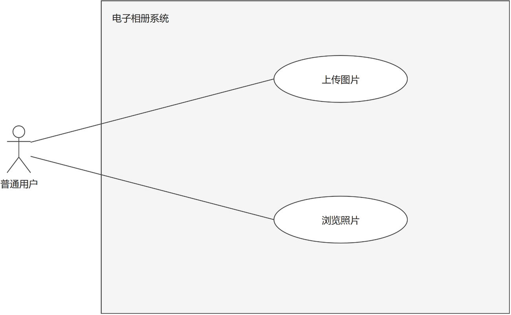
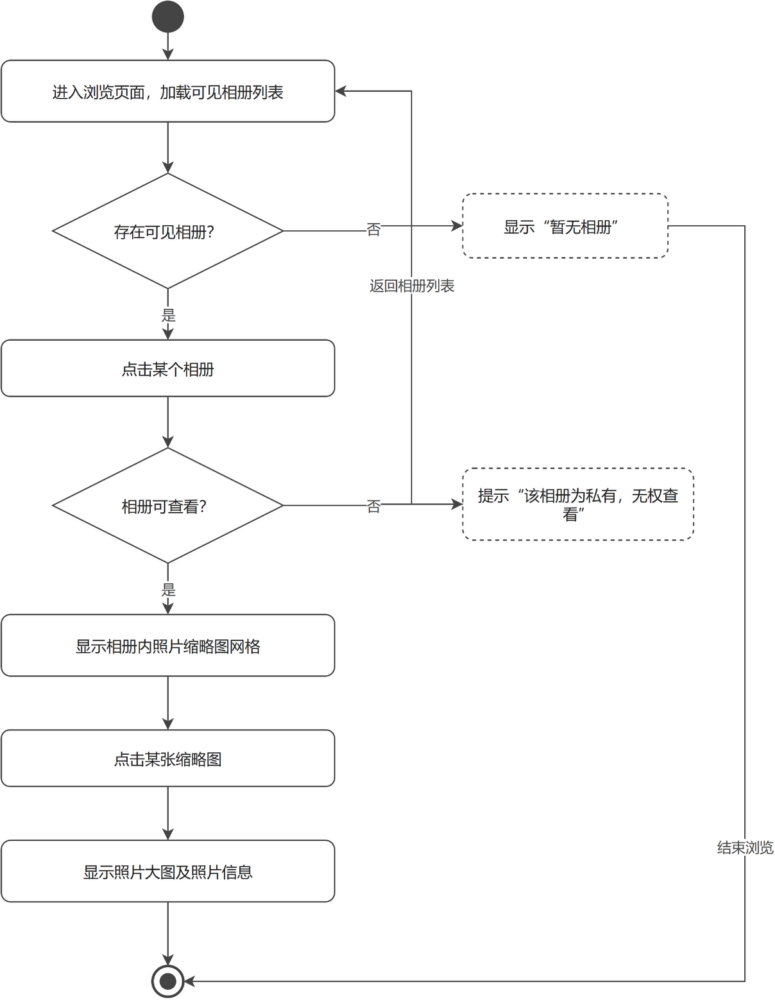
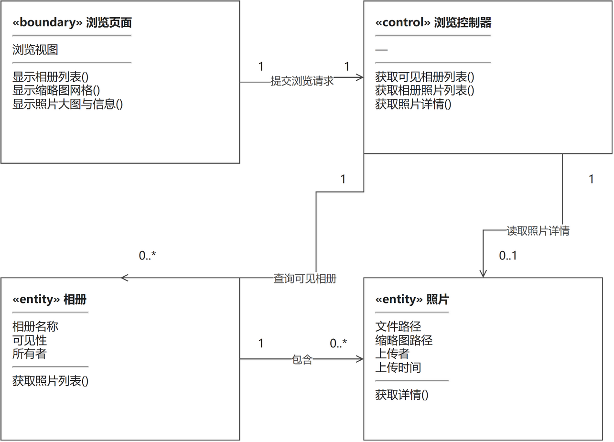
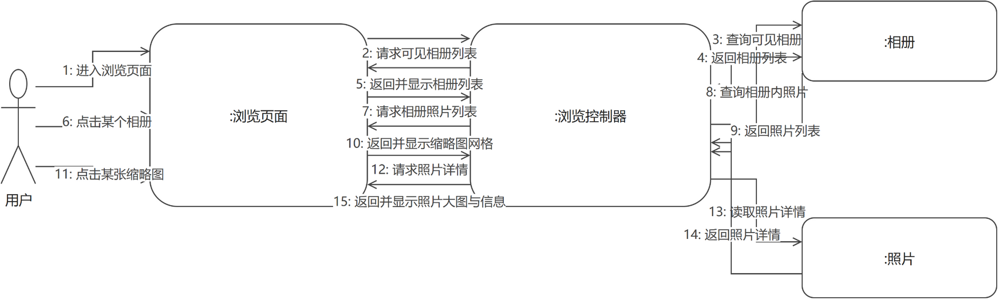

# 浏览照片（成员 D · 照片管理模块）

> 本文件是单个功能用例的完整交付：功能描述（用例 + 用例图 + 活动图）+ 逻辑分析与建模（类模型图 + 协作图）。
> 同模块的「上传图片」用例见 `上传图片.md`，两个用例共用同一张模块用例图。

## 一、功能描述

### 1. 用例描述

- **用例名称**：浏览照片
- **参与者**：普通用户
- **前置条件**：用户已登录
- **基本流程**：
  1. 用户进入浏览页面，系统显示所有公开相册列表（含本人的全部相册）；
  2. 用户点击某个相册；
  3. 系统显示该相册内照片的缩略图网格；
  4. 用户点击某张缩略图；
  5. 系统显示照片大图及照片信息（拍摄/上传时间、上传者、评论列表）。
- **扩展流程**：
  - 1a. 不存在任何可见相册，系统显示"暂无相册"；
  - 2a/链接直达：若用户访问他人私有相册，系统提示"该相册为私有，无权查看"，返回步骤 1。
- **后置条件**：无（只读操作，不改变系统状态）。

（与 `docs/需求分析/02_用例描述初稿.md` 用例 7 口径一致，未做改动。）

### 2. 用例图

**图说明**：大矩形为系统边界（电子相册系统），内部两个椭圆是照片管理模块的两个用例。参与者"普通用户"连接"浏览照片"和"上传图片"两个用例，表示用户既能上传自己的照片，也能浏览公开相册及本人相册中的照片。参与者与用例之间为无箭头实线，表示"参与"关系。

### 3. 活动图

**图说明**：主流程自上而下：进入浏览页面、加载可见相册列表 → 点击某个相册 → 显示相册内照片缩略图网格 → 点击某张缩略图 → 显示照片大图及照片信息 → 结束。两个扩展流程画成判断分支：菱形"存在可见相册？"为否时进入虚线框"显示'暂无相册'"，经"结束浏览"路线直接到达结束节点（对应扩展流程 1a）；菱形"相册可查看？"为否时进入虚线框提示"该相册为私有，无权查看"，回路拐回最上方的"进入浏览页面，加载可见相册列表"（对应扩展流程 2a 的返回步骤 1），覆盖了通过链接直达他人私有相册的情形。两个菱形判断与用例描述中的扩展流程 1a、2a 一一对应。

## 二、逻辑分析与建模

### 1. 类模型图

**图说明**：从用例描述中提取名词作为候选类、动词作为候选方法，按边界/控制/实体（BCE）分为四个分析类。边界类"浏览页面"负责与用户交互：显示相册列表、显示缩略图网格、显示照片大图与信息；控制类"浏览控制器"负责协调：获取可见相册列表、获取相册照片列表、获取照片详情；实体类"相册"保存相册数据（相册名称、可见性、所有者）并提供"获取照片列表"方法，实体类"照片"保存照片数据（文件路径、缩略图路径、上传者、上传时间）并提供"获取详情"方法。关联关系："浏览页面"与"浏览控制器"为 1:1；"浏览控制器"与"相册"为 1 : 0..*——查询结果可能为空列表（对应扩展流程 1a"暂无相册"）；"浏览控制器"与"照片"为 1 : 0..1——按点击的缩略图读取一张照片的详情，若该照片不存在则无实例；"相册"与"照片"为 1 : 0..* 的包含关系——一个相册可容纳多张照片，新建相册时可以为空。

### 2. 协作图

**图说明**：协作图展示用例执行过程中五个对象（用户、浏览页面、浏览控制器、相册、照片）的消息往来，消息编号与用例基本流程一一对应：1 进入浏览页面 → 2 页面请求可见相册列表 → 3 控制器查询"相册"、4 返回相册列表 → 5 页面显示相册列表（第 1 步）→ 6 用户点击某个相册（第 2 步）→ 7 页面请求相册照片列表 → 8 控制器查询相册内照片、9 返回照片列表 → 10 页面显示缩略图网格（第 3 步）→ 11 用户点击某张缩略图（第 4 步）→ 12 页面请求照片详情 → 13 控制器读取"照片"、14 返回照片详情 → 15 页面显示照片大图与信息（第 5 步）。扩展流程的体现：消息 3 查不到任何可见相册时，消息 4 返回空列表，页面显示"暂无相册"（1a），消息 6 及之后的流程不发生；用户访问他人私有相册时（2a），"相册"对象依据可见性判定拒绝访问，页面提示"该相册为私有，无权查看"，流程回到消息 1 重新显示相册列表。

---

## 提交前自查（本用例）

- [x] 用例描述六段式齐全，与 02 初稿口径一致
- [x] 活动图覆盖扩展流程 1a、2a，错误分支形成回路或直达结束
- [x] 类模型图为三栏式（类名/属性/方法），关联带箭头与多重性
- [x] 协作图消息按执行顺序编号（1–15），与基本流程对应
- [x] 每幅图后均有文字说明
- [x] PNG 已目检：无穿框、无压字、文字完整；`.drawio` 源文件已一并提交
