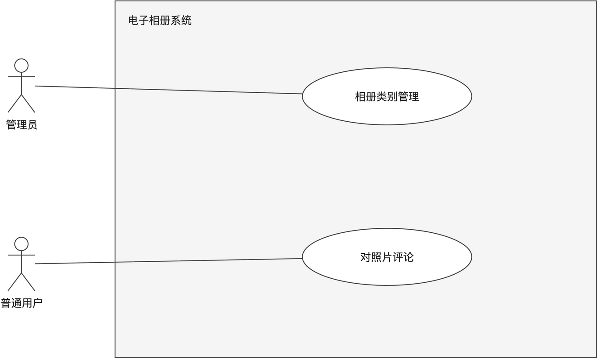
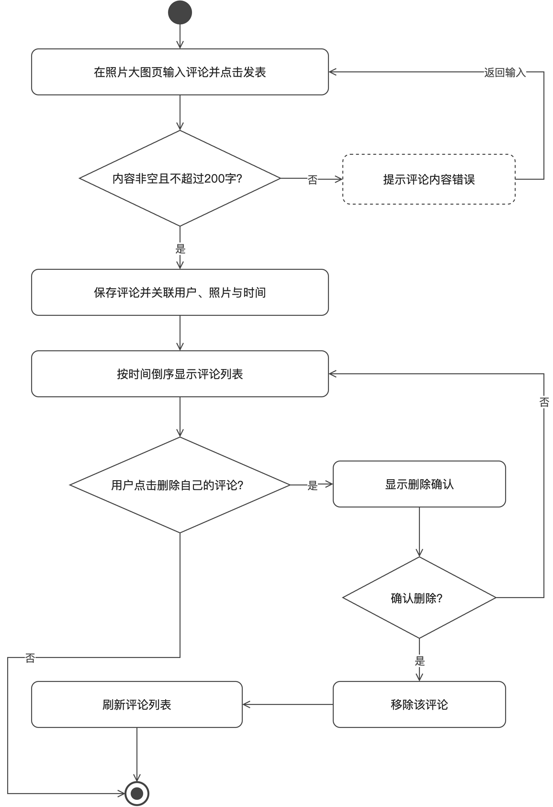
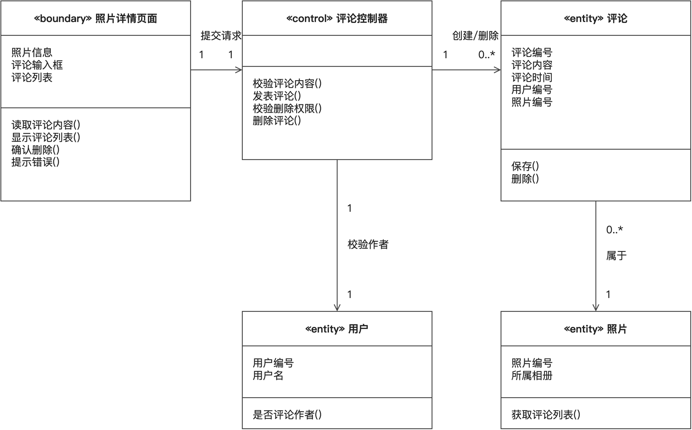
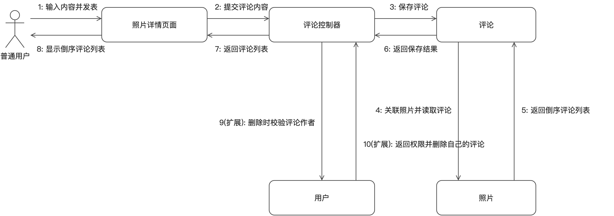

# 对照片评论

## 一、功能描述

### 1. 用例描述

- **用例名称**：对照片评论
- **参与者**：普通用户
- **前置条件**：用户已登录，照片对其可见（公开相册中的照片或本人相册中的照片）。
- **基本流程**：
  1. 用户在照片大图页输入评论内容，点击“发表”；
  2. 系统校验评论内容非空且不超过 200 字；
  3. 系统保存评论，关联评论用户与照片，并记录评论时间；
  4. 评论按时间倒序显示在照片下方的评论列表中。
- **扩展流程**：
  - 2a. 内容为空或超过 200 字，系统提示错误并返回步骤 1；
  - 4a. 用户对自己发表的评论点击“删除”，系统显示确认提示，用户确认后移除该评论并刷新列表；若取消则保留评论并返回列表。
- **后置条件**：照片新增一条评论记录；执行删除扩展流程时，相应评论记录被移除。

（与 `docs/需求分析/02_用例描述初稿.md` 用例 8 口径一致；为便于活动图建模，明确了输入错误、取消删除后的返回位置。）

### 2. 用例图

**图说明**：该模块级用例图与“相册类别管理”共用。普通用户连接“对照片评论”，管理员连接“相册类别管理”；两类参与者不存在交叉连接，强调评论面向已登录普通用户，类别维护属于后台管理职责。

### 3. 活动图

**图说明**：主流程从输入并发表评论开始，校验失败时提示错误并回到输入；校验成功后保存评论并按时间倒序展示。评论展示后绘制“删除自己的评论”扩展分支，用户确认才移除并刷新，取消则返回原评论列表，体现删除必须是本人评论且须经确认。

## 二、逻辑分析与建模

### 1. 类模型图

**图说明**：照片详情页面负责输入、展示与确认交互，评论控制器负责内容校验、发布、权限校验和删除。评论实体保存内容、时间及用户和照片外键；每条评论属于一个用户和一张照片，一张照片可拥有零到多条评论。用户实体提供作者身份判断，使系统只能删除当前用户自己的评论。

### 2. 协作图

**图说明**：消息 1–8 对应发表评论的基本流程：用户提交内容，页面交给控制器，控制器保存评论并关联照片，获取倒序列表后返回页面展示。消息 9–10 表示删除扩展流程：控制器向用户实体校验当前用户是否为评论作者，权限通过后才删除；权限不通过时保留评论并提示无权操作。

## 提交前自查

- [x] 六段式用例描述齐全，与需求初稿口径一致
- [x] 活动图覆盖内容错误、删除确认与取消分支，错误流程形成回路
- [x] 类模型图采用三栏类框并标注关联与多重性
- [x] 协作图基本消息连续编号，删除扩展流程单独标明
- [x] 每幅图均配有文字说明，图片使用相对路径
