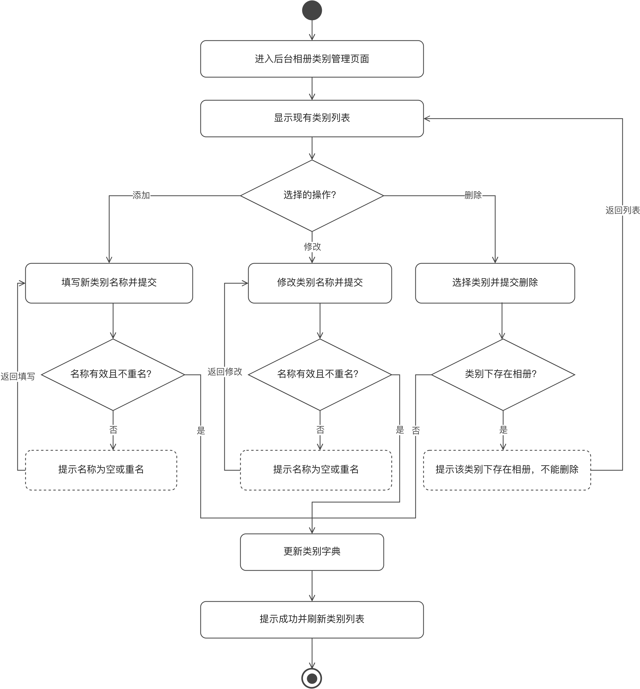
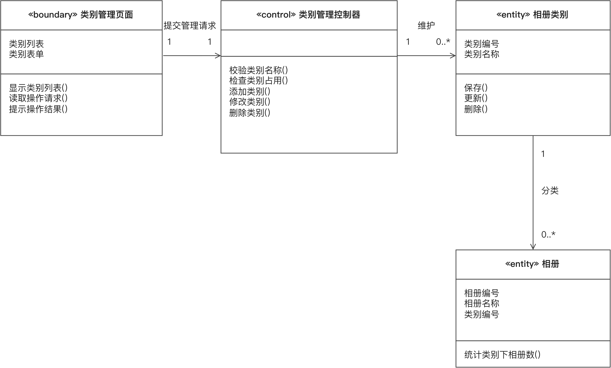
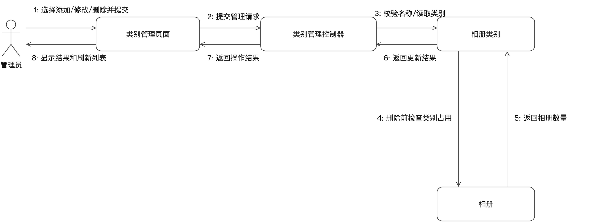

# 相册类别管理（管理员）

## 一、功能描述

### 1. 用例描述

- **用例名称**：相册类别管理
- **参与者**：管理员
- **前置条件**：管理员已登录并进入后台。
- **基本流程**：
  1. 管理员进入后台“相册类别管理”页面；
  2. 系统显示现有类别列表；
  3. 管理员执行添加、修改或删除类别操作并提交；
  4. 系统更新类别字典；
  5. 系统提示操作成功并刷新类别列表。
- **扩展流程**：
  - 3a. 新类别名称为空或与已有类别重名，系统提示错误并返回当前编辑操作；
  - 4a. 删除类别时，若该类别下仍存在相册，系统提示“该类别下存在相册，不能删除”，返回步骤 2。
- **后置条件**：类别字典更新，“创建相册”的可选类别随之变化。

（与 `docs/需求分析/02_用例描述初稿.md` 用例 5 口径一致；仅明确名称错误后的返回位置，未改变业务规则。）

### 2. 用例图

**图说明**：系统边界内放置“相册类别管理”和“对照片评论”两个用例。管理员仅连接相册类别管理，普通用户仅连接对照片评论，清楚体现任务 4 中两个用例的参与者权限与职责边界；参与关系采用无箭头实线。

### 3. 活动图

**图说明**：管理员查看列表后按添加、修改、删除三类操作分支执行。添加和修改都校验名称非空且不重名，失败时返回相应输入步骤；删除前检查类别是否仍被相册占用，占用时提示不能删除并回到类别列表。三个成功分支汇入“更新类别字典”，随后提示成功并刷新列表，完整覆盖基本流程与扩展流程 3a、4a。

## 二、逻辑分析与建模

### 1. 类模型图

**图说明**：采用 BCE 分析方法，将类别管理页面建模为边界类、类别管理控制器建模为控制类，相册类别和相册建模为实体类。控制器负责名称校验、占用检查和增删改协调；一个类别可对应零到多个相册，删除前通过相册实体统计占用数量，从结构上支持“有相册时不能删除”的业务约束。

### 2. 协作图

**图说明**：消息 1–8 展示管理员提交管理操作、页面转交控制器、控制器读取或校验类别、删除前查询相册占用、类别实体执行更新并逐层返回结果的过程。添加或修改时可跳过消息 4–5；删除时必须执行占用检查，若返回数量大于零则不执行更新，并由页面显示不能删除的提示。

## 提交前自查

- [x] 六段式用例描述齐全，与需求初稿口径一致
- [x] 活动图覆盖名称错误与类别占用两个扩展流程并形成返回回路
- [x] 类模型图采用三栏类框并标注关联与多重性
- [x] 协作图消息按执行顺序编号，双向消息使用平行箭头
- [x] 每幅图均配有文字说明，图片使用相对路径
